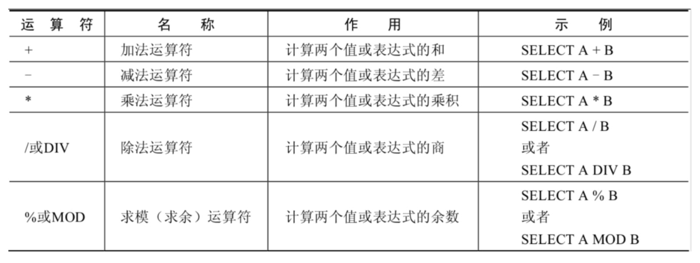

# Why we need Database?
Data Persistence

# ORM(Object Relational Mapping)
1. Table <---> Object Class
2. Table Rows <---> Object Instance
3. Table Cols <---> Attributes or fields of Object

# Table Relationships
1. One-To-One
2. One-To-Many
3. Many-To-Many
4. Self-reference

# Access into MySQL
```
mysql -u <username>  -h <host> -P <port> -p <password[optional]>
```
Linux
```
systemctl start/stop/restar mysqld
```
Window
```
net stop/start <mysql80>
```
# Configuration file
Window
```
my.ini file
```
Linux
```
vim /etc/my.cnf
```

# SQL classfication

1. DDL (Data definition language)
CREATE\AlTER\DROP\RENAME\TRUNCATE(clear but remain table itself)
2. DML (Data Manipulation Language)
INSERT\DELETE\UPDATE\SELECT
3. DCL (Data Control Language)
COMMIT\ROLLBACK\SAVEPOINT\GRANT(给权限)\REVOKE(回收权限)


# SELECT
```sql
SELECT * FROM NAME_OF_TABLE
SELECT...FROM NAME_OF_TABLE
# define alias
SELECT employee_id emp_id, last_name AS lname FROM eployees;
```
## NULL
1. NULL is not 0
2. we can set a default value for the null by following.
```sql
IFNULL(COMMISSION_rate, 0)
```

## ``
When table name clash with reserved keyword, can use \`xxx\`.
```sql
SELECT * FROM `order`
```

## Constant column
```sql
SELECT 'HELLO', 123, employee_id, last_name FROM employees;
-- "HEELO" and 123 are **constant column** in this case 
```
# Structure of Table
```sql
DESCRIBE table_name;
```
# WHERE
Filter the data
```sql
SELECT * FROM employees WHERE column_name = 'value'
```
# Math Operator


1. int + int = int
2. int + float = float
3. There is **no string concatenation**, MySQL will **implicitly convert the string to number else treat as 0** before compute the result.
```sql
SELECT 100 + '1' FROM DUAL;
-- 101
```
4. The result keep 4 decimal places for division.
5. num/0 = null
5. Mod operation 的结果的符号跟被模数一样(第一个数)

# Comparsion Operator

## Equal =
* 100 = '100'
    There will be implicitly conversion for the string comparsion with a number,(string will convert to number) and return 0 if conversion failed as follow.
```sql
SELECT 1 = 2, 1 != 2, 1 = '1', 1 = 'a', 0 = 'a' FROM DUAL;
--       0       1       1       0        1
```
* **比较运算符的两边只要有NULL 参与运算,结果也是NULL**
```sql
1 = NULL => NULL 
NULL = NULL => NULL
```
## Safe Equal <=>
SPECIFICALLY FOR NULL
```sql
SELECT 1 <=> NULL, NULL <=> NULL FROM DUAL;
--        0               1
```
## Not Equal <> or !=
Same rules as equal when it comes to comparsion with a null value and comparion a string with a number.

## Osther operators


%：match 0 or many characters
_：match 1 character
### Regex
1. **^** match a start.
2. **$** match an end.
3. **.** match a single character.
4. **[...]** match any character in the [..]
```sql
    [abc] match a/b/c
    [a-z] match all character between a to z
    [0-9] match all numbers
```
5.* match 0 or many character before it.
```sql
    x* match any nos of x
    [0-9]* match any nos of number
```
# Logic Operator
The result of logic operator is 1, 0 or null.
1. NOT / !
2. AND / &&
3. OR / ||
4. XOR

# Bit Operator
1. & and
2. | or
3. ^ xor
4. ~ not
5. \>> shift right
6. \<< shift left