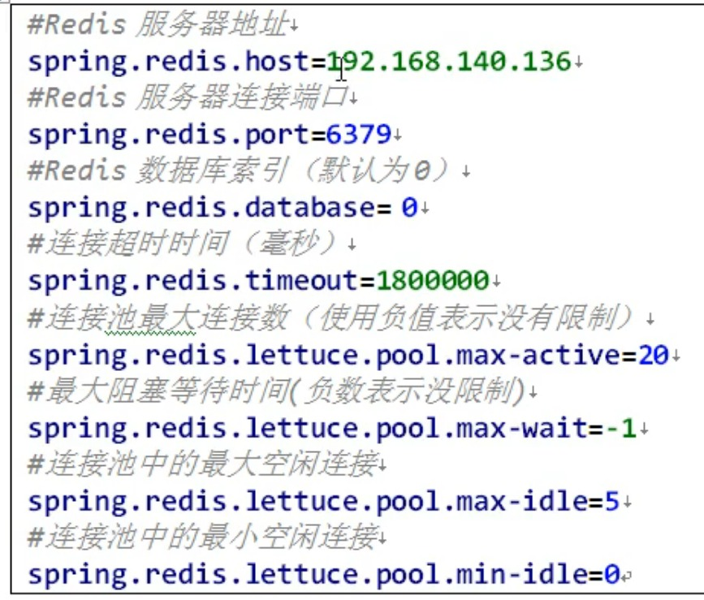

# Redis
NoSQL - Not Only SQL
1. key-value  storage system.
2. Data Types: 
    * string
    * list
    * set
    * zset(sorted set)
    * hash
3. Data are cached in memory.
4. Periodly sync with disk.
5. master-slave sync.

## Install
```bash
#  download 
wget https://download.redis.io/redis-stable.tar.gz
# unpackage
tar -xzvf redis-stable.tar.gz
cd redis-stable
# compliation
make
# install
make install
# check the installed files
cd /usr/local/bin
```
Files
```bash
# performance testing tools
redis-benchmark
redis-cli
# service start up
redis-server
```
## Redis Run as Daemon
```bash
# Copy redis.conf to path that your want. for example /etc
cp redis.conf /etc/redis.conf
# Edit the configuration file
nano /etc/redis.conf
# change daemonize to yes
daemonize yes
# run as daemon
cd /usr/local/bin/
./redis-server /etc/redis.conf
# check process
ps -ef | grep redis 

# access in by CLI
./redis-cli
```

## Note for Database
1. There are 16 databases by default. we can switch db by.
```bash
# select database with target index
select <index>
```
2. Redis is Single Thread & IO multiplexing.(多路IO复用)
3. 6379 port.

## Redis key operations
```bash
# list current keys in the database
keys *
# check whether key existed, 1 exist , 0 not exist
exists <key>
# delete target key
del <key>
unlink <key> # async delete
# set expiration date
expire <key> <number>
# check remianing time before expiration
# -1 never, -2 expired
ttkl <key>
# check nos of keys in the db
dbsize
# clear db
flushdb
# clear all dbs
flushall
```
## Redis Data
### string
* Max. 512MB for the string value
```bash
# set key-value pairs
set <key> <val>
get <key>
# append val to the existing val associated to the key
append <key> <val>
# get length of value
strlen <key>
# put if absent
setnx <key> <value>

# add 1 to the number value or set to 1 if null
incr <key>
# deduct 1 to the number value or set to -1 if null
decr <key>
# incrby/decrby
incrby/decrby <key> <number to be added/deducted>
# set multiple k-v paris
mset <key1> <val1> <key2> <val2> 
mget <key1> <val1> <key2> <val2> 
# set only when not existed
# if any of keys existed then all will be failed
# only all the keys are not existed, it will succeed
msetnx <key1> <val1> <key2> <val2> 

getrange <key> <startIndex> <endIndex>
# override the value from startIndex
setrange <key> <startIndex> <value>
# set value with expiration duration
setex <key> <expiration-duration> <value>
# set new val and get old value
getset <key> <val>
```
### List
Single key -> multiple values with order (deque)
```bash
# push elements from left/right
lpush/rpush key element [element ...]
# get elements
lrange key start stop # -1 means last element
# pop the elements from left/right
lpop/rpop key [count]
# pop elemnt from source at right and push to destination at left
rpoplpush source destination
# get element based on index(0 based)
lindex key index
# get length of list
llen key
# insert element into lits 
linsert key BEFORE|AFTER <pivotElement> <newElement>
# remove count elemnts from left
lrem key count element
# replce element at index
lset key index newElement
```

### Set
The implementation is using hashing structure.
```bash
# create set with key and values
sadd key member [member ...]
# show items in set by key
smembers key
# check whether memeber is in the set
sismember key member
# return cnts of elements
scard key
# delete elements
srem key member [member ...]
# randomly pop cnt element/s
spop key [count]
# randomly select n elements from set
srandmember key [count]
# move an element src set to dest set 
smove source destination member
# intersect(交集)
sinter key [key ...]
# union（并集）
sunion key [key ...]
# difference（差集）（exist in k1 not k2）
sdiff key [key ...]
```

### Hash
```bash
# create hash with key and fileds
hset key field value [field value ...]
# getter for the value of field
hget key field
# check existence of the field
hexists key field
# get key set
hkeys key
# get value set
hvals key
# do increment
hincrby key field increment
# set if absent
hsetnx key field value
```

### Zset
a sorted set with **hashmap + skiplist**

```bash
# zadd topn 200 java 300 c++ 400 php
zadd key [NX|XX] [GT|LT] [CH] [INCR] score member [score member ...]
# get elements from range of index
# zrange topn 0 -1(end)
zrange key start stop [BYSCORE|BYLEX] [REV] [LIMIT offset count] [WITHSCORES]
# get by socre range 
zrangebyscore key min max [WITHSCORES] [LIMIT offset count]
# desc order
zrevrangebyscore key max min [WITHSCORES] [LIMIT offset count]
# increase the score
zincrby key increment member
# delete elements
zrem key member [member ...]
# count the elements by range (inclusive)
zcount key min max
# get the rank of memeber(0 indexed)
zrank key member
```
## Redis Configuration file
```bash
cat/nano/vim /etc/redis.conf
```
## pub/sub(发布订阅)
* publisher can publish the message through specific channel.
* subscriber can subscribe specific channels under specific publisher
* subscribe is able to receive the published message by publisher.
```bash
# subscribe channel
subscribe channel [channel ...]
# publish channel
publish channel message
```
## Bitmaps
```bash
# set bit 
setbit key offset value
# get bit 
getbit key offset
# start and end is the pos index and it can be negative number
bitcount key [start end [BYTE|BIT]]
# bit operation[and or xor]
bitop operation destkey key [key ...]
```
## HyperLogLog(HLL)
similar to set, do not have repeat elements
```bash
# add elements into HyperLogLog
# if successful return 1 else 0
pfadd key [element [element ...]]
# count the elements based on the key
pfcount key [key ...]
# merger the elements in sourcekeys into destkey
pfmerge destkey sourcekey [sourcekey ...]
```

## GeoSpatial
```bash
# add elements under the key
geoadd key [NX|XX] [CH] longitude latitude member [longitude latitude member ...]
# get geo info
geopos key member [member ...]
# get distance with specified unit
geodist key member1 member2 [M|KM|FT|MI]
# get elements within the radius based on the long/lati provided
georadius key longitude latitude radius M|KM|FT|MI [WITHCOORD] [WITHDIST] [WITHHASH] [COUNT count [ANY]] [ASC|DESC] [STORE key] [STOREDIST key]
```

## Jedis
Java -> Redis
```xml
 <dependency>
    <groupId>redis.clients</groupId>
    <artifactId>jedis</artifactId>
    <version>3.2.0</version>
</dependency>
```
1. Update configuration file in order to access remotely and close the firewall if necessary
```bash
# edit the configuration file redis.conf
# comment out following
bind 127.0.0.1 -::1
# set protected-mode to no
protected-mode no
# check firewall status
systemctl status firewalld
# shutdown firewall
systemctl stop firewalld
```
2. Use Jedis with Redis
* String
```java
@Test
public void demo1(){
    Jedis jedis = new Jedis("xx.xx.xx.xx", 6379);

    // set key
    jedis.set("name", "yc");
    // get key
    String name = jedis.get("name");
    System.out.println(name); //yc
    // set multiple key-value pairs
    jedis.mset("k1", "v1", "k2", "v2", "k3", "v3");
    //get multiple keys
    List<String> mget = jedis.mget("k1", "k2", "k3");
    System.out.println(mget.size()); //3
    System.out.println(mget); // [v1, v2, v3]
    // get all keys
    Set<String> keys = jedis.keys("*");
    System.out.println(keys.size()); //4
    for (String key : keys) {
        System.out.println(key);//k3 name k1 k2
    }
}
```
* List
```java
@Test
public void demo2(){
    Jedis jedis = new Jedis("xx.xx.xx.xx", 6379);
    jedis.lpush("my-list1", "v1", "v2", "v3");
    List<String> res = jedis.lrange("my-list1", 0, -1);
    System.out.println(res); //[v3, v2, v1]

}
```
* Set
```java
@Test
public void demo3(){
    Jedis jedis = new Jedis("xx.xx.xx.xx", 6379);
    jedis.sadd("my-set1", "v1", "v2", "v3", "v4");
    Set<String> vals = jedis.smembers("my-set1"); //[v3, v2, v1, v4]
    System.out.println(vals);
}
```
* Hash
```java
@Test
public void demo4(){
    Jedis jedis = new Jedis("xx.xx.xx.xx", 6379);
    jedis.hset("users", "age", "20");
    //jedis.hset("users2", new HashMap<>());
    String hget = jedis.hget("users", "age"); // 20
    System.out.println(hget);
}
```
* Zset
```java
@Test
public void demo5(){
    Jedis jedis = new Jedis("xx.xx.xx.xx", 6379);
    jedis.zadd("china", 100d, "shanghai");
    jedis.zadd("china", 200d, "beijing");
    jedis.zadd("china", 300d, "hk");
    Set<String> cities = jedis.zrange("china", 0, -1);
    System.out.println(cities); //[shanghai, beijing, hk]
}
```
## SpringBoot with Redis

1. import dependency
```xml
<dependency>
    <groupId>org.springframework.boot</groupId>
    <artifactId>spring-boot-starter-data-redis</artifactId>
    <version>2.7.2</version>
</dependency>
<!-- https://mvnrepository.com/artifact/org.apache.commons/commons-pool2 -->
<dependency>
    <groupId>org.apache.commons</groupId>
    <artifactId>commons-pool2</artifactId>
    <version>2.11.1</version>
</dependency>
```
2. Edit configuration file application.properties


3. Create Redis Coniguration class
refer to samples.

4. Use in Controller with Ioc
```java
// use the template class
@Autowired
private RedisTemplate redisTemplate;
//.....
// calling APIs
redisTemplate.opsForValue().set("test", "val1");
String val = (String) redisTemplate.opsForValue().get("test");
```


